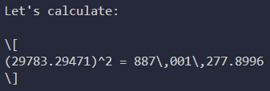
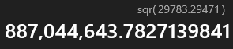
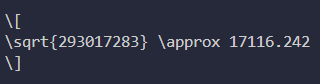
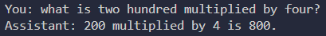

# Introducing DjenkGPT!

Work in progress, documentation will be updated. A lot of inspiration and information for this project comes from John Berryman and Albert Ziegler's [*Prompt Engineering for LLMs*](https://www.oreilly.com/library/view/prompt-engineering-for/9781098156145/) and Chip Huyen's [*AI Engineering*](https://www.oreilly.com/library/view/ai-engineering/9781098166298/)

## Current features of DjenkGPT

- Get an answer for general, math, code questions. Response sourced from internal documents and data the LLM was trained on.

**Everything from here on out is a custom feature/tool not achieavable through using an LLM alone**

- Get real-time weather of a city via tool call. Weather info is fetched with API and returned to LLM, response generated using passed context.

- Get latest news, trends, anything that's web-search worthy. DjenkGPT will search the web for you, sort through multiple results, ranking the most relevant through NearestNeighbor cosine similarity and returning it with a neat and concise summary.

- DjenkGPT remembers important user info such as preferences (writing style, music, learning approach, eg.) and facts (user's age, name, profession, hobbies, eg.).

- DjenkGPT has short- and long-term memory. 
    - **short-term**: Previous 5 user-assistant chat messages are stored raw for clarity.
    - **long-term**: When total messages in short-term memory exceed 8, generate/update a (existing) summary of the earliest 3 messages and remove them from short-term memory.

## Features in depth

### Calculator *(Before)*
LLM calculating comparison with real answers:

### Calculator *(After)*
LLM calculating using the calculator tool:

